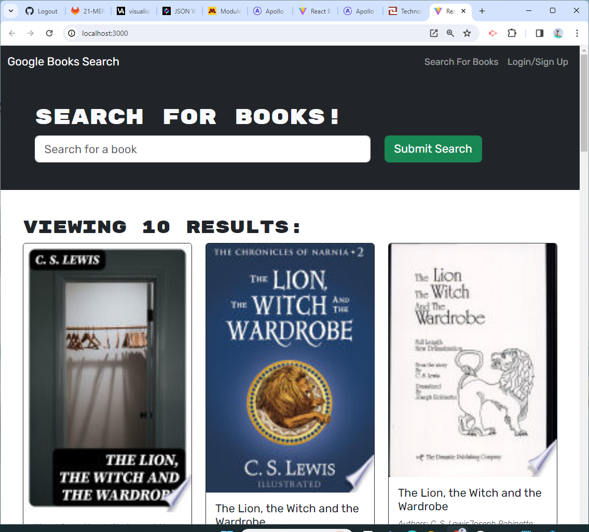

# book-search
This app provides users with an easy way to search for new books to read and keep a list of books for themselves to read or purchase in the future.

## Description
This app will display a screen that allows anyone to search for books in the google API book search. If you sign up, then you can log in and keep a list of books for yourself. When you log in, you can do the following:

1. Search for more books using your own key words.

2. Save books in the list so you can see them every time you log in.

3. Remove books that you aren't interested in anymore or have read/purchased.

## User Story
AS AN avid reader

I WANT to search for new books to read

SO THAT I can keep a list of books to purchase

## Acceptance Criteria
GIVEN a book search engine

WHEN I load the search engine

THEN I am presented with a menu with the options Search for Books and Login/Signup and an input field to search for books and a submit button

WHEN I click on the Search for Books menu option

THEN I am presented with an input field to search for books and a submit button

WHEN I am not logged in and enter a search term in the input field and click the submit button

THEN I am presented with several search results, each featuring a book’s title, author, description, image, and a link to that book on the Google Books site

WHEN I click on the Login/Signup menu option

THEN a modal appears on the screen with a toggle between the option to log in or sign up

WHEN the toggle is set to Signup

THEN I am presented with three inputs for a username, an email address, and a password, and a signup button

WHEN the toggle is set to Login

THEN I am presented with two inputs for an email address and a password and login button

WHEN I enter a valid email address and create a password and click on the signup button

THEN my user account is created and I am logged in to the site

WHEN I enter my account’s email address and password and click on the login button

THEN I the modal closes and I am logged in to the site

WHEN I am logged in to the site

THEN the menu options change to Search for Books, an option to see my saved books, and Logout

WHEN I am logged in and enter a search term in the input field and click the submit button

THEN I am presented with several search results, each featuring a book’s title, author, description, image, and a link to that book on the Google Books site and a button to save a book to my account

WHEN I click on the Save button on a book

THEN that book’s information is saved to my account

WHEN I click on the option to see my saved books

THEN I am presented with all of the books I have saved to my account, each featuring the book’s title, author, description, image, and a link to that book on the Google Books site and a button to remove a book from my account

WHEN I click on the Remove button on a book

THEN that book is deleted from my saved books list

WHEN I click on the Logout button

THEN I am logged out of the site and presented with a menu with the options Search for Books and Login/Signup and an input field to search for books and a submit button

### Mock Up
Search Page

Login

Sign up

Save Book

## Installation/Execution
https://react-portfolio-vmd.netlify.app

Open the react-portfolio by clicking on the above URL. It will open up to my About Me page which is a short bio of me.

To see my current Resume, click on the Resume link in the navigation bar.

To see my current projects, click on the Portfolio link in the navigation bar.

To see contact me, click on the Contact link and fill out the form and click Submit.

## Usage
I am providing this app for potential employers to see what experience I have in Full Stack.

## Credits
N/A

## License
N/A